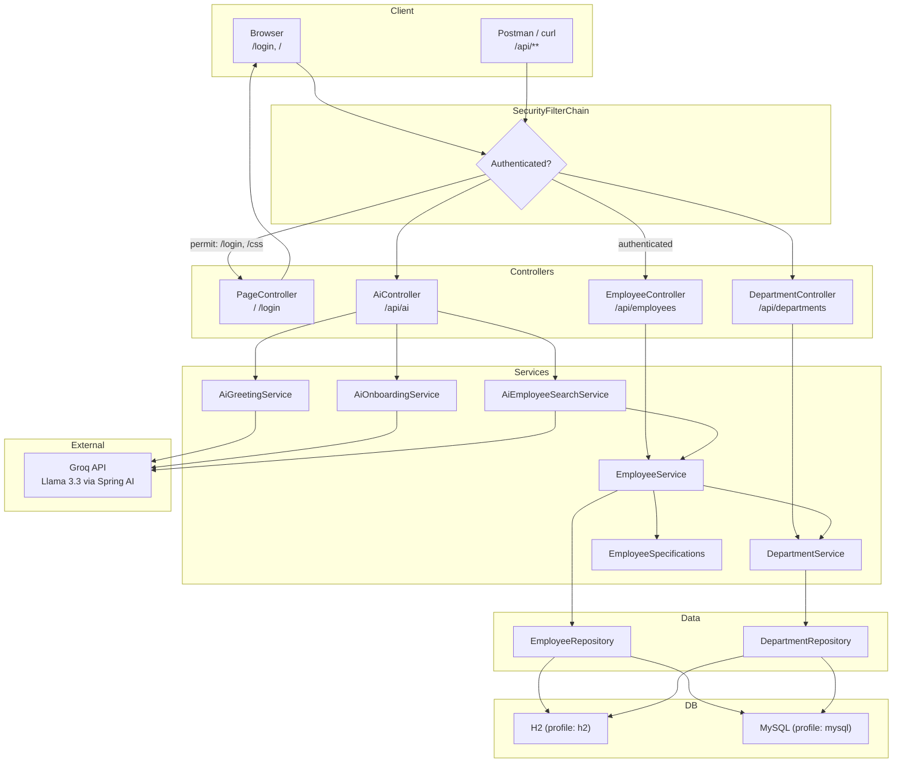
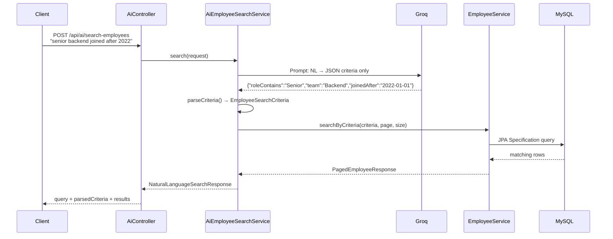

# Week 2 — Final Session Guide (Combined)

> **One session · Project #1 complete**  
> **Code folder:** `week-02-employee-management`  
> **Sources:** [Class-1.md](Class-1.md) + [Class-2.md](Class-2.md) merged into a single teaching flow

---

## Session goal (say this first)

> "Week 1 stopped at `application.yml`. Today we finish **Project #1 — Employee Management System**: layered Spring Boot app, CRUD APIs, Groq AI, Spring Security, MySQL, pagination, natural language search, and a browser login page."

**End state:** Students can explain the full request flow, demo every feature live, and push code to GitHub.

**Time split (~2.5–3 hrs):**

| Block | Duration | What |
|-------|----------|------|
| 1. Recap + architecture | 15 min | Where we came from, layered design |
| 2. Core EMS (live code walk) | 40 min | Entity → Repository → DTO → Service → Controller |
| 3. First AI + error handling | 25 min | ChatClient, PromptTemplate, GlobalExceptionHandler |
| 4. Security | 15 min | HTTP Basic + form login |
| 5. MySQL + pagination | 30 min | Profile switch, Pageable, Specifications |
| 6. NL search (star feature) | 25 min | AI as translator → JPA query |
| 7. Login page + E2E demo | 25 min | Thymeleaf, full test run |
| 8. Wrap | 5 min | Deliverables, Week 3 preview |

---

## Pre-flight (do before class)

| Step | Action |
|------|--------|
| 1 | Open repo root in VS Code / Cursor |
| 2 | `cp week-02-employee-management/.env.example week-02-employee-management/.env` |
| 3 | Paste Groq key in `.env` → `GROQ_API_KEY=gsk_...` |
| 4 | Maven reload (wait for dependencies) |
| 5 | MySQL running + `ems_db` created (see [MySQL setup](#block-5--mysql--pagination)) |
| 6 | F5 launch configs ready: **Week 2 EMS — Run with Groq (H2)** or **Run with MySQL** |

**Credentials (demo only):**

| Field | Value |
|-------|-------|
| Username | `hr@codekerdos.in` |
| Password | `hr123` |

---

## Master flow — where to where



**Layman version (draw on board):**

```
HTTP Request
     ↓
Security (who are you?)
     ↓
Controller  ← JSON in/out, thin
     ↓
Service     ← business rules, @Transactional
     ↓
Repository  ← JPA, no SQL written
     ↓
Database (H2 or MySQL)
```

---

## Teaching flow — class by class, what to show

Teach in this order. For each file: **open it → explain 1 key idea → demo if applicable**.

---

### BLOCK 1 — Recap + architecture (15 min)

**Say:**

- Week 1 = Spring Core (IoC, DI) + Spring Boot scaffold stopped at `application.yml`
- Week 2 = **new folder** `week-02-employee-management` — same EMS domain, complete project
- We are **not training AI** — we **call Groq's hosted LLM** from Java via Spring AI

**Show:**

| File | Why open it |
|------|-------------|
| `EmployeeManagementApplication.java` | `@SpringBootApplication` = config + auto-config + component scan |
| `pom.xml` | Dependencies tell the story: web, JPA, validation, security, thymeleaf, H2, MySQL, Spring AI |
| `application.yml` | Profiles (`h2` / `mysql`), Groq config, datasource |

**Key point:** Layered architecture — Controller → Service → Repository → DB. Never skip layers.

---

### BLOCK 2 — Core EMS (40 min)

Walk bottom-up (DB first, then up to HTTP).

#### Step 1 — Entities (`entity/`)

| File | Show & explain |
|------|----------------|
| `Department.java` | `@Entity`, `@Table`, `@OneToMany` |
| `Employee.java` | `@ManyToOne`, `@JoinColumn`, `FetchType.LAZY` |

**Draw:**

```
Department (1) ──────< Employee (many)
Engineering          Rahul, Priya, Amit
```

**Key point:** JPA maps Java classes → SQL tables. Hibernate creates tables on startup (`ddl-auto: update`).

---

#### Step 2 — Repositories (`repository/`)

| File | Show & explain |
|------|----------------|
| `DepartmentRepository.java` | `extends JpaRepository<Department, Long>` — free CRUD |
| `EmployeeRepository.java` | `JpaSpecificationExecutor<Employee>` — needed for dynamic filters + NL search |

**Key point:** Spring Data generates SQL from interface methods. Zero handwritten SQL for basic ops.

---

#### Step 3 — DTOs (`dto/`)

| File | Show & explain |
|------|----------------|
| `CreateEmployeeRequest.java` | `@NotBlank`, `@NotNull` — validation at API boundary |
| `EmployeeResponse.java` | `from(Employee)` factory — never expose `@Entity` in REST |
| `CreateDepartmentRequest.java` | Same pattern for departments |
| `DepartmentResponse.java` | Clean response shape |

**Key point:** DTOs decouple API contract from database schema. Interview answer: *"Hide entity internals, control what clients see."*

---

#### Step 4 — Services (`service/`)

| File | Show & explain |
|------|----------------|
| `ResourceNotFoundException.java` | Custom exception for 404 |
| `DepartmentService.java` | `create`, `findAll`, `findById` |
| `EmployeeService.java` | `create` loads department by id; `@Transactional` |

**Key point:** Controllers stay thin. Business rules live here. Constructor injection (same DI from Week 1).

---

#### Step 5 — Controllers (`controller/`)

| File | Endpoints | HTTP |
|------|-----------|------|
| `DepartmentController.java` | `POST /api/departments`, `GET /api/departments` | Create, list |
| `EmployeeController.java` | `GET /api/employees`, `GET /api/employees/{id}`, `POST /api/employees`, `DELETE /api/employees/{id}` | CRUD |

**Demo (Postman — auth comes later):**

```http
POST http://localhost:8080/api/departments
Content-Type: application/json

{ "name": "Engineering" }
```

```http
POST http://localhost:8080/api/employees
Content-Type: application/json

{
  "name": "Rahul Sharma",
  "role": "Senior Engineer",
  "team": "Backend",
  "joinedDate": "2023-06-15",
  "departmentId": 1
}
```

```http
GET http://localhost:8080/api/employees
```

---

### BLOCK 3 — AI features (25 min)

**Crisp AI framing (say this):**

> "AI in this bootcamp = **call Groq from Java** using `ChatClient`, same as any `@Service`.
> We use AI as a **translator** — human language → structured JSON → **Java runs the DB query**.
> AI never touches the database directly. Safer, testable, interview-friendly."

#### AI architecture

```
Your Java @Service  →  ChatClient  →  Groq API  →  Llama 3.3  →  text/JSON back
```

**Config** (`application.yml`):

```yaml
spring:
  ai:
    openai:
      api-key: ${GROQ_API_KEY}
      base-url: https://api.groq.com/openai    # Groq speaks OpenAI-compatible API
      chat:
        options:
          model: llama-3.3-70b-versatile
```

---

#### AI Feature 1 — Greeting (proof LLM works)

| File | What it does |
|------|--------------|
| `service/ai/AiGreetingService.java` | Injects `ChatClient.Builder`, sends one-line prompt |
| `controller/AiController.java` | `GET /api/ai/greet?name=...` |

**Demo:**

```http
GET http://localhost:8080/api/ai/greet?name=Shivansh
Authorization: Basic hr@codekerdos.in / hr123
```

**Expected:** `{ "name": "Shivansh", "aiMessage": "..." }`

**Key point:** 5 lines of AI logic. Same DI pattern as `EmployeeService`.

---

#### AI Feature 2 — Onboarding checklist (PromptTemplate)

| File | What it does |
|------|--------------|
| `service/ai/AiOnboardingService.java` | `PromptTemplate` with `{name}`, `{role}`, `{department}`, `{team}` |
| `dto/OnboardingRequest.java` | Request body |
| `AiController.java` | `POST /api/ai/onboarding-checklist` |

**Demo:**

```http
POST http://localhost:8080/api/ai/onboarding-checklist
Content-Type: application/json
Authorization: Basic hr@codekerdos.in / hr123

{
  "name": "Priya Patel",
  "role": "Junior Developer",
  "department": "Engineering",
  "team": "Frontend"
}
```

**Key point:** Reusable prompts with placeholders — production pattern for consistent AI output.

---

#### REST polish — errors

| File | What it does |
|------|--------------|
| `exception/GlobalExceptionHandler.java` | `@RestControllerAdvice` — 404, 400 validation, 400 bad AI parse |

**Demo:**

```http
GET http://localhost:8080/api/employees/999
```

**Expected:** `{ "status": 404, "message": "Employee not found with id: 999" }`

---

### BLOCK 4 — Security (15 min)

| File | What to explain |
|------|-----------------|
| `config/SecurityConfig.java` | `SecurityFilterChain`, `httpBasic`, `formLogin`, CSRF off for `/api/**` |

**Rules:**

| Path | Access |
|------|--------|
| `/login`, `/css/**`, `/h2-console/**` | Public |
| `/api/**` | Authenticated (Basic Auth or session) |
| `/` | Authenticated (redirects to login) |

**Demo:**

1. `GET /api/employees` **without** auth → **401 Unauthorized**
2. Postman → Authorization → Basic Auth → `hr@codekerdos.in` / `hr123` → **200 OK**

**Key point:** `{noop}` = plain text password for class demo only. Production uses BCrypt + env vars.

---

### BLOCK 5 — MySQL + pagination (30 min)

#### MySQL setup

```sql
CREATE DATABASE ems_db CHARACTER SET utf8mb4 COLLATE utf8mb4_unicode_ci;
CREATE USER 'ems_user'@'localhost' IDENTIFIED BY 'ems_pass';
GRANT ALL PRIVILEGES ON ems_db.* TO 'ems_user'@'localhost';
FLUSH PRIVILEGES;
```

**Switch profile:** F5 → **Week 2 EMS — Run with MySQL** (`SPRING_PROFILES_ACTIVE=mysql`)

**Key point:** Zero entity code changes. Only `application.yml` profile block changes. JPA portability.

---

#### Pagination + filtering

| File | What to explain |
|------|-----------------|
| `dto/PagedEmployeeResponse.java` | `content`, `page`, `size`, `totalElements`, `totalPages` |
| `EmployeeService.findAllPaged()` | `PageRequest`, `Sort`, optional team filter |
| `specification/EmployeeSpecifications.java` | `hasTeam()`, `fromCriteria()` — dynamic WHERE |
| `EmployeeController` | `?page=0&size=10&sort=joinedDate,desc&team=Backend` |

**Demo:**

```http
GET http://localhost:8080/api/employees?page=0&size=2&sort=joinedDate,desc
Authorization: Basic hr@codekerdos.in / hr123
```

```http
GET http://localhost:8080/api/employees?team=Backend&page=0&size=10
Authorization: Basic hr@codekerdos.in / hr123
```

**Verify in MySQL Workbench:** `SELECT * FROM employees;` — data persists after restart (unlike H2 mem).

---

### BLOCK 6 — NL search — star feature (25 min)

This is the **wow moment**. Spend time on the pipeline diagram.



**Files to show in order:**

| # | File | Key idea |
|---|------|----------|
| 1 | `dto/EmployeeSearchCriteria.java` | Typed filter object (role, team, department, dates) |
| 2 | `dto/NaturalLanguageSearchRequest.java` | User's English query + page/size |
| 3 | `dto/NaturalLanguageSearchResponse.java` | Query + parsed criteria + results (transparent AI) |
| 4 | `specification/EmployeeSpecifications.fromCriteria()` | Builds dynamic JPA predicates |
| 5 | `service/ai/AiEmployeeSearchService.java` | Prompt → Groq → parse JSON → call EmployeeService |
| 6 | `AiController.java` | `POST /api/ai/search-employees` |

**Say:**

> "Groq returns JSON. Java parses it. Java runs the query. Point at `parsedCriteria` in the response — students see exactly what AI understood."

**Demo (seed 5+ employees first with varied roles/teams/dates):**

```http
POST http://localhost:8080/api/ai/search-employees
Authorization: Basic hr@codekerdos.in / hr123
Content-Type: application/json

{
  "query": "show senior backend engineers who joined after 2022",
  "page": 0,
  "size": 10
}
```

**Try more queries live:**

- `"Engineering department employees"`
- `"junior frontend developers"`
- `"employees who joined before 2021"`

---

### BLOCK 7 — Login page (15 min)

| File | What it does |
|------|--------------|
| `controller/PageController.java` | `GET /` → `home.html`, `GET /login` → `login.html` |
| `templates/login.html` | Form login for HR |
| `templates/home.html` | Welcome + API cheat sheet + logout |
| `static/css/style.css` | Simple styling |
| `SecurityConfig.java` | `formLogin`, `logout`, permit `/login` |

**Demo:**

1. Browser → `http://localhost:8080/` → redirects to `/login`
2. Login with `hr@codekerdos.in` / `hr123` → home page
3. Postman still works with Basic Auth (both methods active)

---

## Complete file map (what lives where)

```
week-02-employee-management/
├── pom.xml
├── .env.example                    ← copy to .env, add GROQ_API_KEY
└── src/main/
    ├── resources/
    │   ├── application.yml         ← profiles: h2 | mysql, Groq config
    │   ├── templates/
    │   │   ├── login.html
    │   │   └── home.html
    │   └── static/css/style.css
    └── java/in/codekerdos/ems/
        ├── EmployeeManagementApplication.java
        ├── config/
        │   └── SecurityConfig.java
        ├── controller/
        │   ├── PageController.java
        │   ├── DepartmentController.java
        │   ├── EmployeeController.java
        │   └── AiController.java
        ├── dto/
        │   ├── CreateDepartmentRequest.java
        │   ├── DepartmentResponse.java
        │   ├── CreateEmployeeRequest.java
        │   ├── EmployeeResponse.java
        │   ├── PagedEmployeeResponse.java
        │   ├── OnboardingRequest.java
        │   ├── EmployeeSearchCriteria.java
        │   ├── NaturalLanguageSearchRequest.java
        │   └── NaturalLanguageSearchResponse.java
        ├── entity/
        │   ├── Department.java
        │   └── Employee.java
        ├── exception/
        │   └── GlobalExceptionHandler.java
        ├── repository/
        │   ├── DepartmentRepository.java
        │   └── EmployeeRepository.java
        ├── service/
        │   ├── DepartmentService.java
        │   ├── EmployeeService.java
        │   ├── ResourceNotFoundException.java
        │   └── ai/
        │       ├── AiGreetingService.java
        │       ├── AiOnboardingService.java
        │       └── AiEmployeeSearchService.java
        └── specification/
            └── EmployeeSpecifications.java
```

---

## End-to-end testing (run this live to close the session)

### Prerequisites

- [ ] MySQL running, `ems_db` exists
- [ ] `.env` has valid `GROQ_API_KEY`
- [ ] F5 → **Week 2 EMS — Run with MySQL**
- [ ] Console shows: `Tomcat started on port 8080`

---

### Test 1 — Browser login

| Step | Action | Expected |
|------|--------|----------|
| 1 | Open `http://localhost:8080/` | Redirect to `/login` |
| 2 | Enter `hr@codekerdos.in` / `hr123` | Redirect to home page |
| 3 | See "Logged in as: hr@codekerdos.in" | Session active |
| 4 | Click Logout | Back to `/login?logout` |

---

### Test 2 — Seed data (Postman, Basic Auth on all requests)

**Auth:** Authorization → Basic Auth → `hr@codekerdos.in` / `hr123`

```http
POST http://localhost:8080/api/departments
Content-Type: application/json

{ "name": "Engineering" }
```

```http
POST http://localhost:8080/api/departments
Content-Type: application/json

{ "name": "HR" }
```

```http
POST http://localhost:8080/api/employees
Content-Type: application/json

{
  "name": "Rahul Sharma",
  "role": "Senior Engineer",
  "team": "Backend",
  "joinedDate": "2023-06-15",
  "departmentId": 1
}
```

```http
POST http://localhost:8080/api/employees
Content-Type: application/json

{
  "name": "Priya Patel",
  "role": "Junior Developer",
  "team": "Frontend",
  "joinedDate": "2024-01-10",
  "departmentId": 1
}
```

```http
POST http://localhost:8080/api/employees
Content-Type: application/json

{
  "name": "Amit Kumar",
  "role": "Senior Engineer",
  "team": "Backend",
  "joinedDate": "2022-03-20",
  "departmentId": 1
}
```

```http
POST http://localhost:8080/api/employees
Content-Type: application/json

{
  "name": "Sneha Reddy",
  "role": "Team Lead",
  "team": "Backend",
  "joinedDate": "2021-08-01",
  "departmentId": 1
}
```

```http
POST http://localhost:8080/api/employees
Content-Type: application/json

{
  "name": "Vikram Singh",
  "role": "HR Manager",
  "team": "People Ops",
  "joinedDate": "2020-11-05",
  "departmentId": 2
}
```

---

### Test 3 — CRUD + pagination

| # | Request | Expected |
|---|---------|----------|
| 1 | `GET /api/employees` | List of 5 employees |
| 2 | `GET /api/employees/1` | Single employee JSON |
| 3 | `GET /api/employees?page=0&size=2&sort=joinedDate,desc` | `totalElements: 5`, `totalPages: 3`, 2 items in `content` |
| 4 | `GET /api/employees?team=Backend` | Only Backend team employees |
| 5 | `GET /api/employees/999` | `404` with clean JSON message |
| 6 | `GET /api/employees` (no auth) | `401 Unauthorized` |

---

### Test 4 — AI endpoints

| # | Request | Expected |
|---|---------|----------|
| 1 | `GET /api/ai/greet?name=YourName` | JSON with `aiMessage` from Groq |
| 2 | `POST /api/ai/onboarding-checklist` (see Block 3) | Bullet-point checklist text |
| 3 | `POST /api/ai/search-employees` with `"senior backend engineers joined after 2022"` | `parsedCriteria` + matching `results.content` |
| 4 | `POST /api/ai/search-employees` with `"HR department"` | Filters by department name |

---

### Test 5 — Database persistence

| Step | Action | Expected |
|------|--------|----------|
| 1 | MySQL Workbench → `SELECT * FROM employees;` | 5 rows visible |
| 2 | Stop app (red square) | — |
| 3 | F5 restart | App starts clean |
| 4 | `GET /api/employees` | Same 5 employees still there |

---

### Test 6 — Delete + verify

```http
DELETE http://localhost:8080/api/employees/5
Authorization: Basic hr@codekerdos.in / hr123
```

Expected: `204 No Content`, then `GET /api/employees` shows 4 employees.

---

### E2E checklist (print this)

```
✅  1. MySQL running — ems_db exists
✅  2. F5 → Week 2 EMS — Run with MySQL
✅  3. Browser login at /login
✅  4. POST departments + POST 5 employees (seed)
✅  5. GET /api/employees?page=0&size=3&sort=joinedDate,desc
✅  6. GET /api/employees?team=Backend
✅  7. POST /api/ai/search-employees → NL query wow moment
✅  8. GET /api/ai/greet?name=YourName
✅  9. GET /api/employees/999 → 404 handler
✅ 10. GET /api/employees (no auth) → 401
✅ 11. MySQL Workbench → SELECT * FROM employees
✅ 12. git add → commit → push (never commit .env)
```

---

## AI summary — three features, one pattern

| Endpoint | AI role | Java role |
|----------|---------|-----------|
| `GET /api/ai/greet` | Generate welcome text | Pass name, return response |
| `POST /api/ai/onboarding-checklist` | Generate HR checklist | PromptTemplate + structured input |
| `POST /api/ai/search-employees` | **Translate English → JSON filters** | Parse JSON → JPA Specification → DB |

**Interview one-liner:**

> "We use the LLM as a structured-data extractor. Java owns the database query. AI never executes SQL."

---

## Week 2 deliverables (Project #1 COMPLETE)

| # | Deliverable |
|---|-------------|
| 1 | `week-02-employee-management` running on MySQL |
| 2 | CRUD + validation + `GlobalExceptionHandler` |
| 3 | HTTP Basic + browser form login |
| 4 | Paginated + filtered employee list |
| 5 | Natural language HR search via Groq |
| 6 | Code pushed to GitHub (no `.env`) |

---

## Troubleshooting quick reference

| Problem | Fix |
|---------|-----|
| 401 on all APIs | Add Basic Auth: `hr@codekerdos.in` / `hr123` |
| Groq 401/500 | Check `.env` + restart F5 |
| Red imports | Maven → Reload Project |
| MySQL connection refused | Start MySQL: `brew services start mysql` |
| Wrong DB (still H2) | Use **Run with MySQL** launch config |
| NL search parse error | Log raw Groq response; strip ` ```json ` fences |
| Empty NL search results | Seed more employees; try broader query |
| Login page 404 | Check `templates/login.html` exists |
| H2 console blank | JDBC URL = `jdbc:h2:mem:emsdb` |

---

## Interview quick reference

| Question | Answer |
|----------|--------|
| Why DTOs? | Decouple API contract from database schema |
| Why `@Transactional`? | Atomic DB operations — all succeed or all roll back |
| What is JPA? | Maps Java objects to relational tables |
| H2 vs MySQL? | H2 = in-memory dev; MySQL = persistent production DB |
| What is Pageable? | Spring abstraction for page / size / sort |
| What is `JpaSpecificationExecutor`? | Dynamic query builder for flexible filters |
| How does NL search work? | LLM → JSON criteria → JPA Specification → DB |
| Why not let AI query DB directly? | Security + testability — Java controls the query |
| What is Groq? | Fast hosted LLM API, OpenAI-compatible |
| What is ChatClient? | Spring AI bean to call any LLM |
| What is PromptTemplate? | Reusable prompt with `{variables}` |
| HTTP Basic vs form login? | Basic = API/Postman; form = browser session |
| What is Thymeleaf? | Server-side HTML template engine for Spring |
| Why new Week 2 folder? | Clean segregation from Week 1 checkpoint |

---

## Week 3 preview (closing line)

> "EMS = **Project #1 — done**. One of three portfolio projects.
> Week 3 starts **Expense Management** in a new folder — same Spring + AI patterns, new domain."

---

*CodeKerdos.in · Week 2 Final Session · `week-02-employee-management`*
